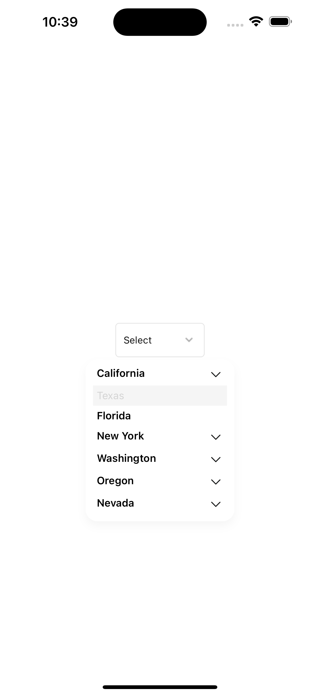
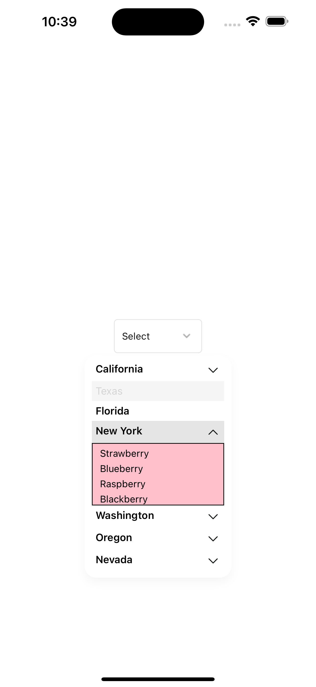

# react-native-simple-dropdown-select

A simple dropdown select picker with support for expo written in typescript. Supports search, one-level of nesting and customisations.

## Installation

```sh
npm install react-native-simple-dropdown-select
```

### Expo

Works with expo

```sh
npx expo install react-native-simple-dropdown-select
```

## Demo Examples

<table>
  <tr>
    <td>Dropdown component</td>
     <td>Texas item disabled</td>
     <td>Florida item has no nested data & is selected.</td>
  </tr>
  <tr>
    <td></td>
    <td></td>
    <td></td>
  </tr>
 </table>

 <table>
  <tr>
    <td>Item with nested data open</td>
     <td>Nested data item is selected</td>
  </tr>
  <tr>
    <td></td>
    <td></td>
  </tr>
 </table>

  <table>
  <tr>
    <td>Search Enabled</td>
  </tr>
  <tr>
    <td></td>
  </tr>
 </table>

## Usage

```tsx
import { DropDownSelect } from 'react-native-simple-dropdown-select';

export default function App() {
  const [open, setOpen] = useState(false);
  const [value, setValue] = useState<any>(null);

  return (
    <View style={{
        flex: 1,
        alignItems: 'center',
        justifyContent: 'center',
    }}>
      <DropDownSelect
        toggle={() => setOpen(!open)}
        selectedData={value}
        open={open}
        data={[
          {
            id: 1,
            name: 'California',
            extraData: ['Apple', 'Banana', 'Orange', 'Mango'],
          },
          {
            id: 2,
            name: 'Texas',
            extraData: ['Tomato', 'Potato', 'Onion', 'Garlic'],
            disabled: true,
          },
          {
            id: 3,
            name: 'Florida',
          },
          {
            id: 4,
            name: 'New York',
            extraData: ['Strawberry', 'Blueberry', 'Raspberry', 'Blackberry'],
          },
          {
            id: 5,
            name: 'Washington',
            extraData: [
              {
                id: 1,
                name: 'Apple',
              },
              {
                id: 2,
                name: 'Banana',
              },
              {
                id: 3,
                name: 'Orange',
              },
              {
                id: 4,
                name: 'Mango',
              },
            ],
          },
          {
            id: 6,
            name: 'Oregon',
            extraData: ['Grapes', 'Cherry', 'Apple', 'Banana', 'Orange'],
          },
          {
            id: 7,
            name: 'Nevada',
            extraData: ['Peach', 'Plum', 'Pear', 'Apricot'],
          },
        ]}
        onSelect={(data) => {
          setValue(data);
          setOpen(false);
        }}
        dropDownContainerStyle={{
          maxHeight: 400,
          minWidth: 200,
        }}
        search
        subViewStyle={{
          backgroundColor: 'pink',
          borderWidth: 1,
        }}
      />
    </View>
  );
}
```

## Props

### data
The `data` prop can change the behaviour of the dropdown select depending on what values it contains.

The basic requirement is for it to have be an array of `{id, name}`. This will render a list with name displayed as title of items.
Some optional fields are:

* `disabled?`: the item will be visible but disabled in the drop down list.
* `extraData?`: with this field, the dropdown item will have a nested select picker. The parent title will serve as an accordion that toggles the nested picker. `extraData` can either be an array of `strings` or `numbers` or an array of `{id, name}`.
* any other extra fields. This will not affect the picker but will be included when the onSelect function is called. 


### search
The `search` prop will enable items in dropdown list to be searchable. A search box will appear. Note that nested items in `extraData` cannot be searched, only top level items.


| Prop | Description | Default |
| --- | --- | --- |
| data | Array of objects of type `{id, name, extraData?, disabled? ..any}` to display in the dropdown. Can have one layer of nested data with `extraData`. `extraData` can be an array of strings or object of type `{id, name, ...any}`  | [] |
| selectedData | Object to display as selected. Has same object as a data item but with a `value` field  | null |
| onSelect | Function to call when an item is selected. Gets passed a data item with a `value` field | null |
| label | Label to display above the dropdown | null |
| placeholder | Placeholder text to display when no item is selected or as search input placeholder | null |
| containerStyle | Style object for the container | null |
| dropDownContainerStyle | Style object for the dropdown container | null |
| search | Boolean to enable search | false |
| searchInputStyle | Style object for the search input | null |
| searchContainerStyle | Style object for the search container | null |
| EmptyListView | React element to display when no items are found | null |
| onChangeSearchText | Function to call when search text changes | null |
| SearchIconLeft | React element to display on the left of the search input | search icon |
| SearchIconRight | React element to display on the right of the search input | close icon |
| onEndReached | Function to call when the end of the list is reached | null |
| labelStyle | Style object for the label | null |
| showsVerticalScrollIndicator | Boolean to show the vertical scroll indicator | false |
| selectedBtnColor | Color for the selected title button | #E5E5E5 |
| selectedSubBtnColor | Color for the selected sub title button if nested with `extraData` | transparent |
| btnColor | Default color for all title buttons not selected | #fff |
| subBtnColor | Default color for all sub title button not selected if nested with `extraData` | transparent |
| onSelectTitle | Function to call when a title is selected | null |
| titleStyle | Style object for the title | null |
| titleButtonStyle | Style object for the title button | null |
| disabledButtonStyle | Style object for the disabled button | null |
| disabledTitleStyle | Style object for the disabled title | null |
| subButtonStyle | Style object for the sub button if nested with `extraData` | null |
| subTitleStyle | Style object for the sub title if nested with `extraData` | null |
| SubCheckedIcon | React element to display as the checked icon if nested with `extraData` | check-mark icon |
| TitleIcon | React element to display as the title icon | chevron up|down icons |
| subViewStyle | Style object for the sub view | null |
| selectedSubTitleStyle | Style object for the selected sub title if nested with `extraData` | null |
| selectedSubBtnStyle | Style object for the selected sub button if nested with `extraData` | null |
| titleProps | Text props for the title | null |
| subTitleProps | Text props for the sub title if nested with `extraData` | null |
| checkedIconPosition | Position for the checked icon. `left` or `right` of title | 'left' |
| SubSeparator | React element to display as the sub separator if nested with `extraData` | null |


## Contributing

See the [contributing guide](CONTRIBUTING.md) to learn how to contribute to the repository and the development workflow.

## License

MIT

---

Made with [create-react-native-library](https://github.com/callstack/react-native-builder-bob)
